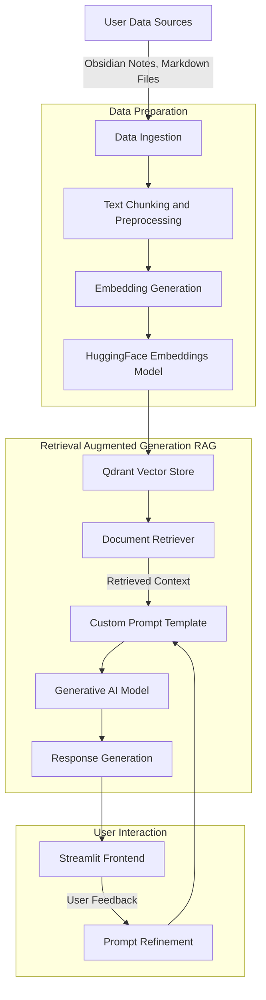

# Documentation

This document provides a detailed overview of the Memo-Mind project, including its architecture, features, and future plans. Memo-Mind is a personalized Retrieval-Augmented Generation (RAG) chatbot built using Qdrant and LangChain, designed to serve as a personal knowledge assistant. Unlike generic chatbots, Memo-Mind is tailored to your unique knowledge base, focusing on your personal notes and writing style. The chatbot does not work with sensitive personal data like credit cards or financial information; instead, it leverages your self-curated content such as notes, social media interactions, and code repositories to provide context-aware assistance.

## Architecture

