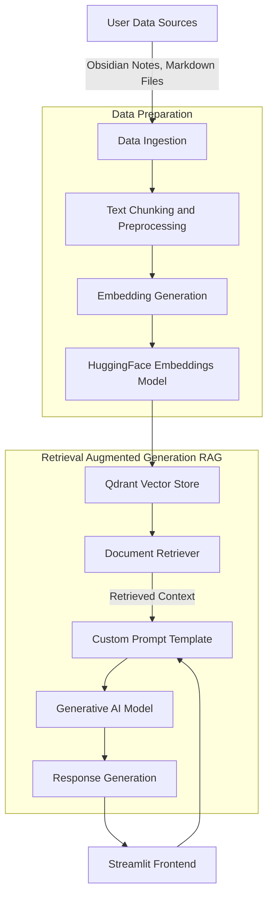
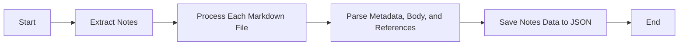
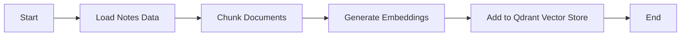
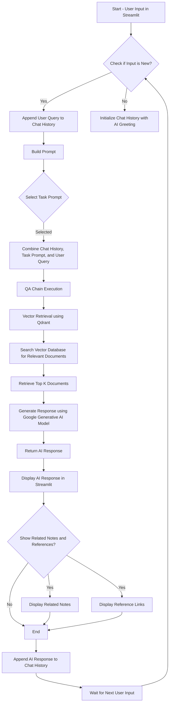

# Memo-Mind Documentation

This document provides a comprehensive overview of the Memo-Mind project, including its architecture, features, and future plans. Memo-Mind is a personalized Retrieval-Augmented Generation (RAG) chatbot built using Qdrant and LangChain, designed to serve as a personal knowledge assistant. Unlike generic chatbots, Memo-Mind is tailored to your unique knowledge base, focusing on your personal notes and writing style. The chatbot does not work with sensitive personal data like credit cards or financial information; instead, it leverages your self-curated content such as notes, social media interactions, and code repositories to provide context-aware assistance.

## Table of Contents
- [Memo-Mind Documentation](#memo-mind-documentation)
  - [Getting Started](#getting-started)
  - [Table of Contents](#table-of-contents)
  - [Architecture](#architecture)
  - [System Architecture and Components](#system-architecture-and-components)
    - [Data Ingestion and Preprocessing](#data-ingestion-and-preprocessing)
    - [Embeddings](#embeddings)
    - [Vector DB Setup](#vector-db-setup)
    - [Generative AI Model](#generative-ai-model)
    - [LangChain Workflow](#langchain-workflow)
    - [Streamlit Frontend](#streamlit-frontend)
  - [Future Enhancements](#future-enhancements)
  - [Conclusion](#conclusion)

## Getting Started
- make sure to clone the repo into your local system:
```git
git clone https://github.com/Srikar-V675/memo-mind.git
```
- now cd into the project
```
cd memo-mind
```
- create a virtual environment
```
python -m venv .venv
```
- activate the virtual environment
```
# macos/linux
source .venv/bin/activate
```
- install the requirements
```
pip install -r requirements.txt
```
- setup Qdrant as your vector db
```docker
docker pull qdrant/qdrant
docker run -p 6333:6333 -p 6334:6334 \
    -v $(pwd)/qdrant_storage:/qdrant/storage:z \
    qdrant/qdrant
```
- run the collector for data extraction from notes
make sure to change the notes_dir to the notes directory in your local machine
```
python collector.py
```
- run the ingestor to convert the processed files into chunks, embed it and store in Qdrant
```
python ingestor.py
```
- now you can run the streamlit app
```
# make sure you have your google studio api_key
run streamlit app.py
```

## Architecture



## System Architecture and Components

### Data Ingestion and Preprocessing

- **Data Sources:** Memo-Mind ingests data from your personal notes in Obsidian vault and markdown files.
- **Data Ingestion:** The data ingestion component reads the data from the Obsidian vault and markdown files.
- **Preprocessing:** The content, along with relevant metadata (such as related notes via wikilinks and external references), is collected and preprocessed.
- **Transform:** The preprocessed data is stored in a JSON format for further processing.

The JSON data structure looks like this:
```json
[
    {
        "title": "Note Title",
        "related_notes": ["Note 1", "Note 2"],
        "content": "Note Content in markdown format",
        "references": [
            {
                "title": "Reference Title",
                "url": "Reference URL"
            }
        ]
    }
]
```

**Refer to:** [Data Ingestion](https://github.com/Srikar-V675/memo-mind/blob/master/collector.py)

### Embeddings

- **HuggingFace Embeddings Model:** The preprocessed data is passed through a HuggingFace embeddings model to generate embeddings for each note. The `BAAI/bge-large-en` model is employed for this purpose.
- **Text Chunking:** After experimenting with various chunking strategies, the `RecursiveCharacterTextSplitter` is utilized with `chunk_size=1000` and `chunk_overlap=150`.
- **Content and Metadata Storage:** The embeddings of each chunk and associated metadata are stored in the Qdrant Vector Store.

**Example:**


**Refer to:** [Embeddings](https://github.com/Srikar-V675/memo-mind/blob/master/ingestor.py)

### Vector DB Setup
- **Qdrant Vector Store:** The embeddings generated by the HuggingFace model are stored in the Qdrant Vector Store, which enables efficient vector search and retrieval.
- **LangChain Qdrant Integration:** LangChain provides a plugin for seamless integration with the Qdrant Vector Store.
- **Running Qdrant:** Qdrant can be executed locally using Docker on the default port `6333` and features a web interface for managing the vector store.
- **Vector Store Configuration:** The Qdrant Vector Store is set up to store the embeddings and metadata of the notes, facilitating efficient retrieval.
- **Vector Store Search:** The Qdrant Vector Store employs the `mmr` Maximum Marginal Relevance algorithm to retrieve the top 10 results with `lambda_mult=0.25`.

**Refer to:** [Vector Store Setup](https://github.com/Srikar-V675/memo-mind/blob/master/ingestor.py) and [Qdrant Search](https://github.com/Srikar-V675/memo-mind/blob/master/app.py)

### Generative AI Model
- **Model Selection:** Google's `gemini-1.5-flash-7b` model is utilized for generating responses based on the retrieved information. This 7 billion parameter model excels in various tasks and offers high-speed performance.
- **Custom Prompt Template:** Retrieved context is combined with a custom prompt template to facilitate response generation, designed to assist users in tasks such as content creation, summarization, and revision.

```python
prompt = """
Chat history: 
{chat_hostory}

{task_prompt}

User question:
{user_query}

Refer to the chat history for context. Use task prompt to generate a response based on the user query and retrieved information.
```

**Refer to:** [Generative AI Model](https://github.com/Srikar-V675/memo-mind/blob/master/app.py)

### LangChain Workflow

- **LangChain Integration:** LangChain manages data flow, ensuring seamless retrieval of relevant information from the vector store and subsequent response generation.
- **Pipeline Management:** LangChain facilitates the orchestration of different components within the architecture, including retrieval and response generation.

**Refer to:** [LangChain Workflow](https://github.com/Srikar-V675/memo-mind/blob/master/app.py)

### Streamlit Frontend
- **User Interface:** The Streamlit frontend offers an interactive platform for users to engage with the chatbot. Users can input queries and receive context-aware responses derived from their notes and writing style.
- **Custom Prompts:** A selection of custom prompts is available for users to guide the chatbot's responses. These prompts cater to various tasks, including content generation, summarization, and revision.

**Refer to:** [Streamlit Frontend](https://github.com/Srikar-V675/memo-mind/blob/master/app.py) and [Custom Prompts](https://github.com/Srikar-V675/memo-mind/blob/master/prompts.json)

## Future Enhancements
- **Enhanced Data Sources:** Future iterations of Memo-Mind aim to incorporate additional data sources such as social media interactions (e.g., LinkedIn posts, GitHub code) and other digital footprints to further enrich the knowledge base.
- **Advanced Features:** Planned enhancements include improving the generative model's ability to mimic individual writing styles more accurately, as well as implementing multi-turn conversations for a more interactive experience.
- **User Customization:** Users will have the option to customize the chatbot's behavior and response style through an intuitive interface, allowing for a more personalized experience.

## Conclusion
Memo-Mind represents a unique approach to personal knowledge management, leveraging advanced technologies to create a tailored chatbot experience. By focusing on individual users' data, Memo-Mind serves as a powerful tool for content generation, revision, and knowledge recall. Future developments will continue to enhance the chatbot's capabilities, making it an indispensable resource for personal and professional use.

